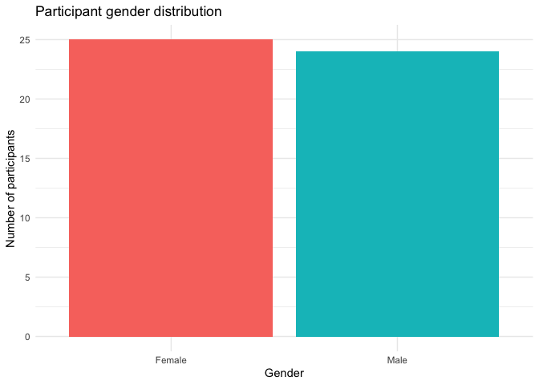
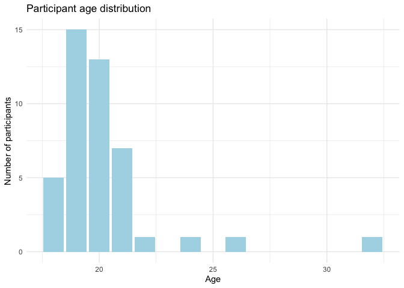
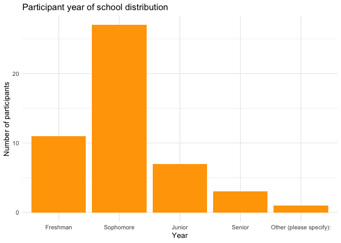

Data Cleaning & Exploratory Graphs
================
Eva Wu
2022-05-18

## Data Cleaning

### Import data

This code chunk is to import concatenated data, delete irrelevant
variables and metadata to prepare for further data cleaning. We have
data from both jspsych and Qualtrics, and the two were linked by
participants’ `qualtrics_id` (10-digit random number assigned by
Qualtrics; this was copied automatically to jspsych) and their
`jspsych_id` (14-digit random letters and numbers assigned at the end of
jspsych task; they were asked to manually copy and paste this code to
Qualtrics to show that they finished the jspsych task; all but one
pasted the right code).

### Drop NA

This code chunk exists only because there were problems with the linking
of Qualtrics and jspsych data. This code chunck is to filter out
participants who did not do anything in the survey/categorization task.
Some participants had duplicate rows, one with response and the other
blank. Others had two rows, one with Qualtrics response but blank
jspsych response, the other with full jspsych response but blank
Qualtrics response. This step is to make sure we delete duplicates and
combine each participant’s Qualtrics and jspsych data into one row.

### Demographics and headphone test data

The following code chunk is to extract demographics and headphone test
data, combine them together, and filter out those who did not pass the
headphone test.

    ## # A tibble: 8 × 3
    ##   qualtrics_id headphone test_corr
    ##   <chr>            <dbl>     <dbl>
    ## 1 1044403354           0         2
    ## 2 2077443174           0         2
    ## 3 3619423604           0         0
    ## 4 5405144116           0         0
    ## 5 6323213291           0         2
    ## 6 6783315289           0         2
    ## 7 8089229725           0         0
    ## 8 9018846073           0         1

Setting 4 as the pass threshold, we can see that 8 participants did not
pass the headphone test (answered fewer than 4 questions correctly). For
now I’ll keep them, but later we can see if deleting them makes a big
difference, and then decide whether to keep them.

### Tonality categorization and explicit emotional valence ratings data

The following code chunk extracts categorization and explicit rating
data respectively, and manipulates them to create 3 new data frames, one
with participants’ categorization, explicit ratings, and demographics
combined ([all.csv](all.csv)), another with participants’ demographics,
including headphone test and music experience
([demo_test.csv](demo_test.csv)), and still another with the
descriptives and categorization and explicit ratings data
([descriptives.csv](descriptives.csv)).

## Cleaned data!

A snapshot of the data (aka codebook):

<table>
<thead>
<tr>
<th style="text-align:left;">
variable_names
</th>
<th style="text-align:left;">
variable_meaning
</th>
</tr>
</thead>
<tbody>
<tr>
<td style="text-align:left;">
qualtrics_id
</td>
<td style="text-align:left;">
Random 10-digit ID assigned by Qualtrics, used to join Qualtrics and
jspsych data
</td>
</tr>
<tr>
<td style="text-align:left;">
instrument
</td>
<td style="text-align:left;">
Instrument used to "play" the stimuli
</td>
</tr>
<tr>
<td style="text-align:left;">
tuning_step
</td>
<td style="text-align:left;">
Tuning step of 3rd (middle note) of the chord (1 = absolute minor, 5 =
absolute major, 2-4 = ambiguous tonality)
</td>
</tr>
<tr>
<td style="text-align:left;">
chord
</td>
<td style="text-align:left;">
Key stimuli were in
</td>
</tr>
<tr>
<td style="text-align:left;">
pct_maj
</td>
<td style="text-align:left;">
Percent proportion of chords categorized as major
</td>
</tr>
<tr>
<td style="text-align:left;">
explicit_rtg
</td>
<td style="text-align:left;">
Explicit valence rating of instrument
</td>
</tr>
<tr>
<td style="text-align:left;">
participant
</td>
<td style="text-align:left;">
Random 14-digit combination of letters and numbers, used to verify
completion of jspsych task
</td>
</tr>
<tr>
<td style="text-align:left;">
passed_practice
</td>
<td style="text-align:left;">
Passed practice or not (1 = pass)
</td>
</tr>
<tr>
<td style="text-align:left;">
block_passed_practice
</td>
<td style="text-align:left;">
Number of attempts taken to pass
</td>
</tr>
<tr>
<td style="text-align:left;">
practice_score
</td>
<td style="text-align:left;">
Practice score (out of 12)
</td>
</tr>
<tr>
<td style="text-align:left;">
Age
</td>
<td style="text-align:left;">
</td>
</tr>
<tr>
<td style="text-align:left;">
Gender
</td>
<td style="text-align:left;">
</td>
</tr>
<tr>
<td style="text-align:left;">
Year
</td>
<td style="text-align:left;">
</td>
</tr>
<tr>
<td style="text-align:left;">
Year_6\_TEXT
</td>
<td style="text-align:left;">
If not a student or faculty
</td>
</tr>
<tr>
<td style="text-align:left;">
Major
</td>
<td style="text-align:left;">
</td>
</tr>
<tr>
<td style="text-align:left;">
Major_5\_TEXT
</td>
<td style="text-align:left;">
If not a psych or music major
</td>
</tr>
<tr>
<td style="text-align:left;">
Inst
</td>
<td style="text-align:left;">
If they have ever played an instrument or not
</td>
</tr>
<tr>
<td style="text-align:left;">
Start
</td>
<td style="text-align:left;">
At what age they started playing an instrument
</td>
</tr>
<tr>
<td style="text-align:left;">
Inst_now
</td>
<td style="text-align:left;">
Still playing now?
</td>
</tr>
<tr>
<td style="text-align:left;">
Inst_list
</td>
<td style="text-align:left;">
List of instruments played
</td>
</tr>
<tr>
<td style="text-align:left;">
Inst_yr
</td>
<td style="text-align:left;">
Years they played their most trained instrument
</td>
</tr>
<tr>
<td style="text-align:left;">
Inst_num
</td>
<td style="text-align:left;">
Number of instruments played
</td>
</tr>
<tr>
<td style="text-align:left;">
Ens
</td>
<td style="text-align:left;">
If they have ever participated in ensemble or not
</td>
</tr>
<tr>
<td style="text-align:left;">
Course
</td>
<td style="text-align:left;">
Taken music courses or not
</td>
</tr>
<tr>
<td style="text-align:left;">
Course_list
</td>
<td style="text-align:left;">
List of music courses taken
</td>
</tr>
<tr>
<td style="text-align:left;">
Read
</td>
<td style="text-align:left;">
Read music or not
</td>
</tr>
<tr>
<td style="text-align:left;">
Pitch&Tempo_1
</td>
<td style="text-align:left;">
Self-rated ability to perceive and remember pitch
</td>
</tr>
<tr>
<td style="text-align:left;">
Pitch&Tempo_2
</td>
<td style="text-align:left;">
Self-rated ability to perceive and remember tempo
</td>
</tr>
<tr>
<td style="text-align:left;">
PT1
</td>
<td style="text-align:left;">
Self-rated ability to perceive and remember pitch / 10, used to
calculate overall music experience
</td>
</tr>
<tr>
<td style="text-align:left;">
PT2
</td>
<td style="text-align:left;">
Self-rated ability to perceive and remember tempo / 10, used to
calculate overall music experience
</td>
</tr>
<tr>
<td style="text-align:left;">
Perf
</td>
<td style="text-align:left;">
Has perfect pitch or not (1 = yes, 0 = no, -1 = don’t know
</td>
</tr>
<tr>
<td style="text-align:left;">
Time_make
</td>
<td style="text-align:left;">
Time spent making music per week
</td>
</tr>
<tr>
<td style="text-align:left;">
Time_make_num
</td>
<td style="text-align:left;">
Time spent making music per week converted to numeric
</td>
</tr>
<tr>
<td style="text-align:left;">
Time_listen
</td>
<td style="text-align:left;">
Time spent listening to music per day
</td>
</tr>
<tr>
<td style="text-align:left;">
Time_listen_num
</td>
<td style="text-align:left;">
Time spent listening to music per day converted to numeric
</td>
</tr>
<tr>
<td style="text-align:left;">
Concert
</td>
<td style="text-align:left;">
Number of concerts attended per year
</td>
</tr>
<tr>
<td style="text-align:left;">
Genre_18
</td>
<td style="text-align:left;">
Proportion of each genre listened to (total 100)
</td>
</tr>
<tr>
<td style="text-align:left;">
Genre_8
</td>
<td style="text-align:left;">
</td>
</tr>
<tr>
<td style="text-align:left;">
Genre_9
</td>
<td style="text-align:left;">
</td>
</tr>
<tr>
<td style="text-align:left;">
Genre_17
</td>
<td style="text-align:left;">
</td>
</tr>
<tr>
<td style="text-align:left;">
Genre_10
</td>
<td style="text-align:left;">
</td>
</tr>
<tr>
<td style="text-align:left;">
Genre_11
</td>
<td style="text-align:left;">
</td>
</tr>
<tr>
<td style="text-align:left;">
Genre_12
</td>
<td style="text-align:left;">
</td>
</tr>
<tr>
<td style="text-align:left;">
Genre_13
</td>
<td style="text-align:left;">
</td>
</tr>
<tr>
<td style="text-align:left;">
Genre_16
</td>
<td style="text-align:left;">
</td>
</tr>
<tr>
<td style="text-align:left;">
Genre_14
</td>
<td style="text-align:left;">
</td>
</tr>
<tr>
<td style="text-align:left;">
Genre_15
</td>
<td style="text-align:left;">
</td>
</tr>
<tr>
<td style="text-align:left;">
Genre_15_TEXT
</td>
<td style="text-align:left;">
Other genres not mentioned
</td>
</tr>
<tr>
<td style="text-align:left;">
music_exp
</td>
<td style="text-align:left;">
Arbitrary summary of music experience
</td>
</tr>
<tr>
<td style="text-align:left;">
headphone
</td>
<td style="text-align:left;">
Passed headphone test or not (1 = pass)
</td>
</tr>
<tr>
<td style="text-align:left;">
test_corr
</td>
<td style="text-align:left;">
Number of correct answers in headphone test
</td>
</tr>
</tbody>
</table>

## Descriptives

    ## [1] "descriptives for categorization in the key of B"

    ## # A tibble: 5 × 6
    ## # Groups:   instrument [5]
    ##   instrument   `1`   `2`   `3`   `4`   `5`
    ##   <fct>      <dbl> <dbl> <dbl> <dbl> <dbl>
    ## 1 xylophone   0.36  0.43  0.62  0.84  0.84
    ## 2 trumpet     0.22  0.29  0.58  0.75  0.74
    ## 3 piano       0.24  0.3   0.48  0.8   0.84
    ## 4 violin      0.24  0.31  0.59  0.74  0.76
    ## 5 oboe        0.18  0.18  0.39  0.61  0.69

    ## [1] "descriptives for categorization in the key of C"

    ## # A tibble: 5 × 6
    ## # Groups:   instrument [5]
    ##   instrument   `1`   `2`   `3`   `4`   `5`
    ##   <fct>      <dbl> <dbl> <dbl> <dbl> <dbl>
    ## 1 xylophone   0.21  0.26  0.51  0.92  0.93
    ## 2 trumpet     0.12  0.16  0.53  0.9   0.88
    ## 3 piano       0.19  0.16  0.38  0.88  0.94
    ## 4 violin      0.08  0.15  0.4   0.79  0.89
    ## 5 oboe        0.04  0.12  0.24  0.68  0.8

    ## [1] "descriptives for explicit ratings in the key of B"

    ## # A tibble: 5 × 6
    ## # Groups:   instrument [5]
    ##   instrument   `1`   `2`   `3`   `4`   `5`
    ##   <fct>      <dbl> <dbl> <dbl> <dbl> <dbl>
    ## 1 xylophone   0.36  0.43  0.62  0.84  0.84
    ## 2 trumpet     0.22  0.29  0.58  0.75  0.74
    ## 3 piano       0.24  0.3   0.48  0.8   0.84
    ## 4 violin      0.24  0.31  0.59  0.74  0.76
    ## 5 oboe        0.18  0.18  0.39  0.61  0.69

    ## [1] "descriptives for explicit ratings in the key of C"

    ## # A tibble: 5 × 6
    ## # Groups:   instrument [5]
    ##   instrument   `1`   `2`   `3`   `4`   `5`
    ##   <fct>      <dbl> <dbl> <dbl> <dbl> <dbl>
    ## 1 xylophone   3     3     3     3     3   
    ## 2 trumpet     2.7   2.7   2.7   2.7   2.7 
    ## 3 piano       2.91  2.91  2.91  2.91  2.91
    ## 4 violin      2.13  2.13  2.13  2.13  2.13
    ## 5 oboe        2.22  2.22  2.22  2.22  2.22

## Demographic analysis

<!-- --><!-- --><!-- --><!-- -->

Turns out the number of female and male participants did not differ
much. Most participants were aged 18-21, while a few above 22. We had
greater number of sophomores, than freshmen, than juniors, than seniors,
than others. Most participants were neither a psychology major nor a
music major.

## Practice Score

Participants who failed their first attempt in the practice section
could re-do it for a second time. Let’s check how many passed in their
2nd attempt. Let’s also check the distribution of practice score.

    ## # A tibble: 2 × 44
    ##   participant   qualt…¹ passe…² block…³ pract…⁴   Age Gender Year  Year_…⁵ Major
    ##   <chr>         <chr>     <dbl>   <dbl>   <dbl> <dbl> <chr>  <fct> <chr>   <chr>
    ## 1 c1vn7ym2gp4m… 270199…       1       2       9    19 Female Fres… <NA>    Psyc…
    ## 2 5281kj47nhob… 678331…       1       2       8    20 Male   Soph… <NA>    Othe…
    ## # … with 34 more variables: Major_5_TEXT <chr>, Inst <int>, Start <int>,
    ## #   Inst_now <int>, Inst_list <chr>, Inst_yr <dbl>, Inst_num <dbl>, Ens <int>,
    ## #   Course <int>, Course_list <chr>, Read <int>, `Pitch&Tempo_1` <int>,
    ## #   `Pitch&Tempo_2` <int>, PT1 <dbl>, PT2 <dbl>, Perf <int>, Time_make <chr>,
    ## #   Time_make_num <dbl>, Time_listen <chr>, Time_listen_num <dbl>,
    ## #   Concert <int>, Genre_18 <chr>, Genre_8 <chr>, Genre_9 <chr>,
    ## #   Genre_17 <chr>, Genre_10 <chr>, Genre_11 <chr>, Genre_12 <chr>, …

<!-- -->

Only 2 failed the 1st time. The rest all passed in the 1st try. Most
passed with 12/12.

## Categorization exploratory plot

Plot a smooth line graph to see how instrument and tuning step affected
tonality categorization.

<!-- -->

Xylophone: overall most likely to be judged as major when tuning is
unclear

Oboe: overall most likely to be judged as minor when tuning is unclear

## Explicit emotional valence rating exploratory plot

<!-- -->

Xylophone: rated “happiest” on average, then piano, then trumpet, then
oboe, and violin rated the “saddest”.

## Compare trend between tonality judgment and explicit rating

<!-- -->

Trend for categorization is similar to that for explicit rating. But
there was a tiny bit of difference:

Explicit valence rating: violin lowest, violin \< oboe

Categorization: oboe lowest, violin \> oboe
